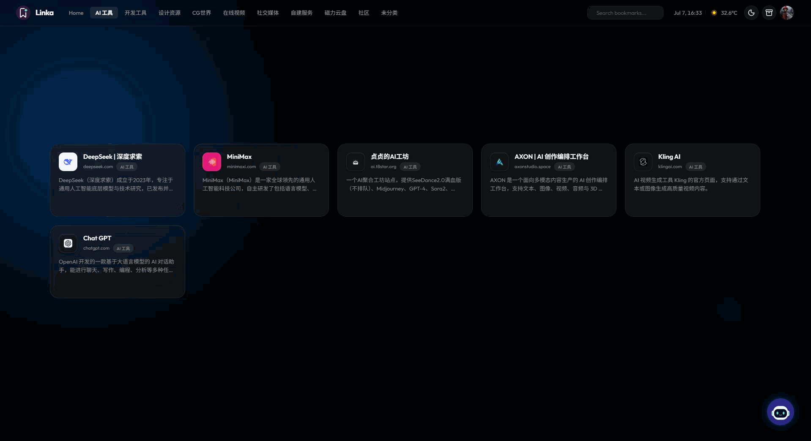

<div align="center">
  
</div>

<h1 align="center">Linka</h1>

<p align="center">
  <b>Save it. Let AI organize it.</b>
</p>

<p align="center">
  面向个人和小团队自托管场景的 AI 书签管理器。<br/>
  抓取网页元数据，使用大语言模型生成摘要、分类和标签，通过对话式 AI 助手完成收藏、检索和多模态内容理解。
</p>

<p align="center">
  <a href="./README_EN.md">English</a> ·
  <b>简体中文</b> ·
  <a href="#快速开始">快速开始</a> ·
  <a href="#功能特性">功能特性</a> ·
  <a href="#api-文档">API 文档</a>
</p>

<p align="center">
  
  
  
  
  
</p>

<p align="center">
  
</p>

## 功能特性

- 书签管理：添加、编辑、删除、分页和搜索 URL 收藏。
- 元数据抓取：自动解析标题、描述、favicon 和封面图。
- 智能整理：基于 AI 生成摘要、推荐分类并提取标签。
- 分类视图：支持自定义分类管理，并在首页无缝切换。
- 多语言支持 (i18n)：内置简体中文、繁体中文（香港、台湾）和英文，并可一键切换。
- AI 助手：通过自然语言搜索书签、添加收藏、补充描述和执行书签操作。
- 安全的指令执行：AI 在执行删除等高风险操作前，会弹出交互式卡片请求二次确认，防止误操作。
- 灵活的 UI 体验：支持可拖拽调整宽度的 AI 助手侧边栏，支持语音输入，适配不同设备。
- 多模态输入：助手支持图片、视频和普通附件上传；图片理解依赖当前模型能力。
- 多供应商配置：支持 OpenAI 兼容接口和 Anthropic 消息接口。
- 模型能力配置：可为每个模型设置上下文长度、默认模型和是否支持视觉理解。
- 历史会话：保存 AI 助手对话上下文，支持多会话切换，并保留附件历史记录。
- 本地存储：SQLite 持久化，适合桌面、本机服务器和 NAS 部署。
- Docker 部署：提供 Dockerfile 和 Docker Compose 配置。

## 技术栈

| 模块 | 技术 |
| --- | --- |
| 前端 | Vue 3, Vite, TypeScript, Vue Router |
| 后端 | Node.js, Fastify, TypeScript |
| 数据库 | SQLite, better-sqlite3 |
| AI 接口 | OpenAI compatible, Anthropic Messages compatible |
| 文档 | Swagger UI / OpenAPI |
| 部署 | Docker, Docker Compose |

## 项目结构

```text
.
├── apps
│   ├── client          # Vue 前端应用
│   └── server          # Fastify 后端服务
├── assets              # README 和项目展示图片
├── data                # 本地 SQLite 数据目录
├── dist                # 构建产物
├── docker-compose.yml
├── Dockerfile
└── package.json
```

## 快速开始

### 环境要求

- Node.js 22 或更高版本
- npm
- Docker 和 Docker Compose，可选

### 本地开发

```bash
npm install
npm run dev
```

默认服务地址：

- 前端开发服务：[http://localhost:5173](http://localhost:5173)
- 后端 API：[http://localhost:3030](http://localhost:3030)
- Swagger UI：[http://localhost:3030/documentation](http://localhost:3030/documentation)

首次启动会自动创建默认账号：

```text
用户名：admin
密码：linka123456
```

登录后建议在账号设置中修改用户名、头像和密码。

## 环境变量

复制 `.env.example` 为 `.env`，按需调整：

```env
LINKA_PORT=3030
LINKA_HOST=0.0.0.0
LINKA_DB_PATH=./data/linka.sqlite
LINKA_APP_URL=http://localhost:3030

OPENAI_API_KEY=
OPENAI_BASE_URL=https://api.openai.com/v1
OPENAI_MODEL=gpt-4.1-mini

LINKA_API_TOKEN=
```

常用配置说明：

| 变量 | 默认值 | 说明 |
| --- | --- | --- |
| `LINKA_PORT` | `3030` | 后端监听端口 |
| `LINKA_HOST` | `0.0.0.0` | 后端监听地址 |
| `LINKA_DB_PATH` | `./data/linka.sqlite` | SQLite 数据库路径 |
| `LINKA_APP_URL` | `http://localhost:3030` | 应用访问地址，用于 Cookie 安全策略判断 |
| `OPENAI_API_KEY` | 空 | 首次启动时的默认 OpenAI 供应商密钥 |
| `OPENAI_BASE_URL` | `https://api.openai.com/v1` | OpenAI 兼容接口地址 |
| `OPENAI_MODEL` | `gpt-4.1-mini` | 默认 OpenAI 模型名 |
| `LINKA_API_TOKEN` | 空 | 外部 API 调用令牌，配置后需要 `Authorization: Bearer <token>` |

AI 供应商、接口格式、模型列表、温度、上下文长度和视觉理解能力都可以在应用设置页维护。环境变量中的 OpenAI 配置只用于首次初始化，后续以数据库中的设置为准。

## AI 供应商配置

Linka 当前支持两类接口格式：

- `OpenAI 兼容接口`：请求路径为 `/chat/completions`，适合 OpenAI、DeepSeek、Qwen、OpenRouter 等兼容服务。
- `Anthropic 消息接口`：请求路径为 `/v1/messages`，适合 Claude 或提供 Anthropic 兼容协议的服务。

模型配置中可以开启 `支持视觉理解`。只有开启该能力的模型才会接收图片或视频附件；如果供应商安全策略拦截图片，Linka 会在助手中显示对应提示。

## 常用脚本

```bash
npm run dev      # 同时启动前端和后端开发服务
npm run check    # 执行前端和后端 TypeScript 检查
npm run build    # 构建前端静态文件和后端产物
npm run start    # 启动生产构建后的后端服务
```

单独运行工作区脚本：

```bash
npm run dev -w apps/client
npm run dev -w apps/server
npm run check -w apps/client
npm run check -w apps/server
```

## 生产构建

```bash
npm run build
npm run start
```

构建后，后端会托管 `dist/public` 中的前端静态文件，默认访问地址为：

```text
http://localhost:3030
```

## Docker 部署

Linka 提供了官方的 Docker 镜像，你可以通过 Docker Hub 获取：
[hongleiyu/linka - Docker Hub](https://hub.docker.com/repository/docker/hongleiyu/linka/general)

### 方式一：使用 Docker Compose（推荐）

创建一个 `docker-compose.yml` 文件：

```yaml
version: '3.8'
services:
  linka:
    image: hongleiyu/linka:latest
    container_name: linka
    ports:
      - "3030:3030"
    volumes:
      - ./data:/app/data
    restart: unless-stopped
```

然后运行：

```bash
docker compose up -d
```

### 方式二：使用 Docker CLI

```bash
docker run -d \
  --name linka \
  -p 3030:3030 \
  -v $(pwd)/data:/app/data \
  --restart unless-stopped \
  hongleiyu/linka:latest
```

### 方式三：从源码构建运行

如果你克隆了本仓库，也可以直接从源码构建：

```bash
docker compose up -d --build
```

**数据持久化**：
无论哪种部署方式，都会将容器内 `/app/data` 映射到本地 `./data`，用于保存 SQLite 数据库和相关的配置文件。部署到 NAS 或服务器时，强烈建议定期备份该目录以防数据丢失。

## API 文档

服务启动后可访问：

- Swagger UI：[http://localhost:3030/documentation](http://localhost:3030/documentation)
- OpenAPI JSON：[http://localhost:3030/documentation/json](http://localhost:3030/documentation/json)

接口模块包括：

- 认证与账号设置
- 书签管理
- 分类管理
- AI 供应商和模型配置
- AI 助手会话与 SSE 流式对话

## API 示例

新增收藏：

```bash
curl -X POST http://localhost:3030/api/bookmarks \
  -H "Content-Type: application/json" \
  -d "{\"url\":\"https://example.com\",\"source\":\"web\"}"
```

配置 `LINKA_API_TOKEN` 后：

```bash
curl -X POST http://localhost:3030/api/bookmarks \
  -H "Content-Type: application/json" \
  -H "Authorization: Bearer your-token" \
  -d "{\"url\":\"https://example.com\",\"source\":\"chrome-extension\"}"
```

AI 助手流式对话接口：

```http
POST /api/assistant/chat/stream
Content-Type: application/json
```

```json
{
  "message": "帮我搜索 AI 图标相关收藏",
  "model": "MiniMax-M3",
  "effort": "默认",
  "activeCategory": "设计资源"
}
```

## Chrome 扩展集成

浏览器扩展或外部自动化工具只需要把当前页面 URL 和标题发送到后端：

```http
POST /api/bookmarks
Authorization: Bearer <token>
Content-Type: application/json
```

```json
{
  "url": "https://example.com",
  "title": "当前页面标题",
  "source": "chrome-extension"
}
```

AI Key 不需要放进扩展或客户端，所有 AI 调用都由 Linka 后端完成。

## 数据与安全建议

- `data/linka.sqlite` 保存书签、分类、AI 设置、账号和会话历史。
- 不要提交 `.env`、数据库文件或真实 API Key。
- 首次部署后请立即修改默认密码。
- 对公网开放服务前，建议放在反向代理后方，并启用 HTTPS。
- `LINKA_API_TOKEN` 只保护外部 API 调用，不替代登录账号密码。

## 开发说明

- 前端 API 封装位于 `apps/client/src/api.ts`。
- AI 助手前端状态位于 `apps/client/src/composables/useAssistant.ts`。
- AI 调用、模型协议适配和多模态消息组装位于 `apps/server/src/services/ai.ts`。
- 书签工具调用推断和执行位于 `apps/server/src/services/assistantTools.ts`。
- 供应商与模型配置持久化位于 `apps/server/src/services/settings.ts`。

提交前建议执行：

```bash
npm run check
npm run build
```

## Roadmap

- Chrome 扩展正式版。
- 更多导入导出格式。
- 更细粒度的多用户权限。
- 可配置的元数据抓取策略。
- 更完整的测试覆盖。

## License

本项目基于 [MIT License](./LICENSE) 开源。
