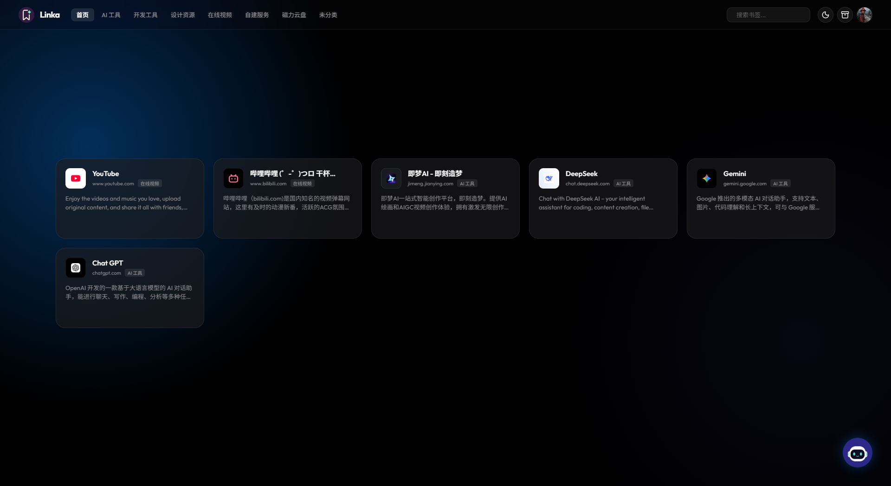

# Linka

> Save it. Let AI organize it.

[简体中文](./README.md) | English

Linka is an AI-powered bookmark manager for personal and small team self-hosting scenarios. It fetches web page metadata, uses large language models to generate summaries, categories, and tags, and utilizes a conversational AI assistant for saving, retrieving, and understanding multi-modal content.

<p align="center">
  
</p>

## Features

- **Bookmark Management**: Add, edit, delete, paginate, and search your URL collections.
- **Metadata Scraping**: Automatically parse titles, descriptions, favicons, and cover images.
- **Smart Organization**: Generate summaries, recommend categories, and extract tags via AI.
- **Category Views**: Support custom category management and seamless switching on the home page.
- **Multi-language Support (i18n)**: Built-in Simplified Chinese, Traditional Chinese (Hong Kong, Taiwan), and English, with one-click switching.
- **AI Assistant**: Search bookmarks, add collections, supplement descriptions, and execute bookmark operations using natural language.
- **Safe Execution**: Before performing high-risk operations like deletion, the AI pops up an interactive card to request secondary confirmation, preventing accidental operations.
- **Flexible UI Experience**: Resizable AI assistant sidebar via drag-and-drop, voice input support, and responsive across different devices.
- **Multi-modal Input**: The assistant supports image, video, and standard file attachments; image understanding relies on the current model's capabilities.
- **Multi-provider Configuration**: Supports OpenAI-compatible interfaces and Anthropic Messages interfaces.
- **Model Capabilities Configuration**: Configure context length, default models, and vision capabilities for each model.
- **Chat History**: Save AI assistant conversation context, support multi-conversation switching, and retain attachment history.
- **Local Storage**: SQLite persistence, suitable for desktop, local servers, and NAS deployments.
- **Docker Deployment**: Dockerfile and Docker Compose configurations provided.

## Tech Stack

| Module | Technology |
| --- | --- |
| Frontend | Vue 3, Vite, TypeScript, Vue Router |
| Backend | Node.js, Fastify, TypeScript |
| Database | SQLite, better-sqlite3 |
| AI Interfaces | OpenAI compatible, Anthropic Messages compatible |
| Documentation | Swagger UI / OpenAPI |
| Deployment | Docker, Docker Compose |

## Project Structure

```text
.
├── apps
│   ├── client          # Vue frontend application
│   └── server          # Fastify backend service
├── assets              # README and showcase images
├── data                # Local SQLite data directory
├── dist                # Build outputs
├── docker-compose.yml
├── Dockerfile
└── package.json
```

## Quick Start

### Prerequisites

- Node.js 22 or higher
- npm
- Docker and Docker Compose (optional)

### Local Development

```bash
npm install
npm run dev
```

Default service URLs:

- Frontend dev server: [http://localhost:5173](http://localhost:5173)
- Backend API: [http://localhost:3030](http://localhost:3030)
- Swagger UI: [http://localhost:3030/documentation](http://localhost:3030/documentation)

A default account will be automatically created on the first startup:

```text
Username: admin
Password: linka123456
```

It's recommended to change the username, avatar, and password in the account settings after logging in.

## Environment Variables

Copy `.env.example` to `.env` and adjust as needed:

```env
LINKA_PORT=3030
LINKA_HOST=0.0.0.0
LINKA_DB_PATH=./data/linka.sqlite
LINKA_APP_URL=http://localhost:3030

OPENAI_API_KEY=
OPENAI_BASE_URL=https://api.openai.com/v1
OPENAI_MODEL=gpt-4.1-mini

LINKA_API_TOKEN=
```

Common Configuration Explanations:

| Variable | Default Value | Description |
| --- | --- | --- |
| `LINKA_PORT` | `3030` | Backend listening port |
| `LINKA_HOST` | `0.0.0.0` | Backend listening address |
| `LINKA_DB_PATH` | `./data/linka.sqlite` | SQLite database path |
| `LINKA_APP_URL` | `http://localhost:3030` | App access URL, used for Cookie security policy |
| `OPENAI_API_KEY` | Empty | Default OpenAI provider key on first startup |
| `OPENAI_BASE_URL` | `https://api.openai.com/v1` | OpenAI compatible API URL |
| `OPENAI_MODEL` | `gpt-4.1-mini` | Default OpenAI model name |
| `LINKA_API_TOKEN` | Empty | External API access token. Requires `Authorization: Bearer <token>` when set |

AI providers, interface formats, model lists, temperatures, context lengths, and vision capabilities can all be maintained in the application settings page. The OpenAI settings in the environment variables are only used for the initial setup, after which the settings in the database take precedence.

## AI Provider Configuration

Linka currently supports two interface formats:

- `OpenAI Compatible`: Request path is `/chat/completions`. Suitable for OpenAI, DeepSeek, Qwen, OpenRouter, and other compatible services.
- `Anthropic Messages`: Request path is `/v1/messages`. Suitable for Claude or services providing Anthropic compatible protocols.

In the model configuration, you can enable `Supports Vision`. Only models with this capability enabled will receive image or video attachments. If the provider's security policy blocks images, Linka will display a corresponding prompt in the assistant.

## Common Scripts

```bash
npm run dev      # Start both frontend and backend dev servers
npm run check    # Run frontend and backend TypeScript checks
npm run build    # Build frontend static files and backend outputs
npm run start    # Start the production-built backend service
```

Run workspace scripts individually:

```bash
npm run dev -w apps/client
npm run dev -w apps/server
npm run check -w apps/client
npm run check -w apps/server
```

## Production Build

```bash
npm run build
npm run start
```

After building, the backend will host the frontend static files from `dist/public`. The default access address is:

```text
http://localhost:3030
```

## Docker Deployment

```bash
docker compose up -d --build
```

By default, the container's `/app/data` is mapped to the local `./data` directory to save the SQLite database. When deploying to a NAS or server, regular backups of this directory are recommended.

## API Documentation

Accessible after starting the service:

- Swagger UI: [http://localhost:3030/documentation](http://localhost:3030/documentation)
- OpenAPI JSON: [http://localhost:3030/documentation/json](http://localhost:3030/documentation/json)

API Modules include:

- Authentication and Account Settings
- Bookmark Management
- Category Management
- AI Provider and Model Configuration
- AI Assistant Chat and SSE Streaming

## API Examples

Add a bookmark:

```bash
curl -X POST http://localhost:3030/api/bookmarks \
  -H "Content-Type: application/json" \
  -d "{\"url\":\"https://example.com\",\"source\":\"web\"}"
```

With `LINKA_API_TOKEN` configured:

```bash
curl -X POST http://localhost:3030/api/bookmarks \
  -H "Content-Type: application/json" \
  -H "Authorization: Bearer your-token" \
  -d "{\"url\":\"https://example.com\",\"source\":\"chrome-extension\"}"
```

AI Assistant Streaming Chat API:

```http
POST /api/assistant/chat/stream
Content-Type: application/json
```

```json
{
  "message": "Help me search for AI icon related bookmarks",
  "model": "MiniMax-M3",
  "effort": "Default",
  "activeCategory": "Design Resources"
}
```

## Chrome Extension Integration

Browser extensions or external automation tools only need to send the current page URL and title to the backend:

```http
POST /api/bookmarks
Authorization: Bearer <token>
Content-Type: application/json
```

```json
{
  "url": "https://example.com",
  "title": "Current Page Title",
  "source": "chrome-extension"
}
```

AI Keys don't need to be placed in the extension or client; all AI calls are handled by the Linka backend.

## Data & Security Recommendations

- `data/linka.sqlite` saves bookmarks, categories, AI settings, accounts, and chat history.
- Do not commit `.env`, database files, or real API Keys.
- Please change the default password immediately after the first deployment.
- Before opening the service to the public internet, it is recommended to place it behind a reverse proxy and enable HTTPS.
- `LINKA_API_TOKEN` only protects external API calls and does not replace login account passwords.

## Development Notes

- Frontend API encapsulation is located in `apps/client/src/api.ts`.
- AI assistant frontend state is located in `apps/client/src/composables/useAssistant.ts`.
- AI calls, model protocol adaptation, and multimodal message assembly are in `apps/server/src/services/ai.ts`.
- Bookmark tool invocation inference and execution are in `apps/server/src/services/assistantTools.ts`.
- Provider and model configuration persistence is in `apps/server/src/services/settings.ts`.

Recommended commands before committing:

```bash
npm run check
npm run build
```

## Roadmap

- Official Chrome Extension.
- More import/export formats.
- Finer-grained multi-user permissions.
- Configurable metadata scraping strategies.
- More comprehensive test coverage.

## License

This project is open-sourced under the [MIT License](./LICENSE).
